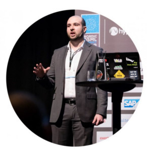

[Home](https://mgcodesandstats.github.io/) |
[GitHub](https://github.com/mgcodesandstats) |
[Speaking Engagements](https://mgcodesandstats.github.io/speaking-engagements/) |
[Terms](https://mgcodesandstats.github.io/terms/) |
[E-mail](mailto:contact@michael-grogan.com)

# Background

I am a data scientist with a passion for statistics and programming.

My educational background is a Master's degree in Economics from University College Cork, Ireland. As such, much of my work has been in the domain of business intelligence; i.e. using machine learning technologies to develop solutions to a wide range of business problems.

## Examples of past projects

* Delivered extensive seminar titled [TensorFlow 2.0 Essentials: What's New](https://learning.oreilly.com/live-training/courses/tensorflow-20-essentials-whats-new/0636920307167/) for O'Reilly Media

* Implemented time series forecasting techniques for a local authority which significantly informed future policy considerations for their domain

* Constructed multilevel model which allowed a company to improve prediction accuracy across complex survey data by 15%

## Portfolio Samples

* [Hotel Booking Cancellations: Classification, Regression, and Time Series Analysis](https://www.michael-grogan.com/hotel-modelling)

* [Image Recognition with Keras: Convolutional Neural Networks](https://www.michael-grogan.com/image-recognition-with-keras-convolutional-neural-networks/)

* [TensorFlow 2.0 essentials: What's New](https://github.com/MGCodesandStats/tfv2)
